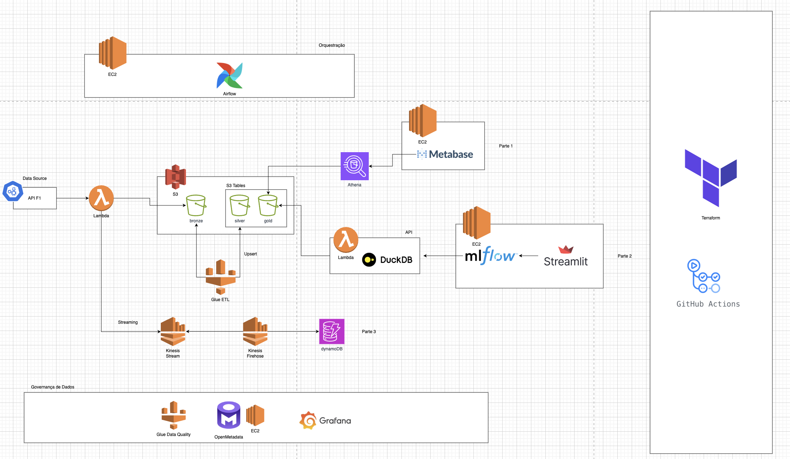

# f1-data-platform
An end-to-end data platform for ingesting and analyzing Formula 1 data. Built on AWS, it features a dual batch/streaming architecture, with analytics served through Metabase and a Streamlit application.



## Development Workflow - Git Flow

Este projeto utiliza o **Git Flow** como estratégia de branching para organizar o desenvolvimento de forma estruturada e colaborativa.

### Estrutura de Branches

- **main**: Branch de produção com código estável e testado
- **develop**: Branch de desenvolvimento onde features são integradas
- **feature/**: Branches para desenvolvimento de novas funcionalidades
- **release/**: Branches para preparação de novas versões
- **hotfix/**: Branches para correções urgentes em produção

### Pré-requisitos

Instale o Git Flow (no macOS):
```bash
brew install git-flow-avh
```

Inicialize o Git Flow no projeto (apenas na primeira vez):
```bash
git flow init -d
```

### Comandos Principais

#### 🚀 Desenvolvendo Features

**Iniciar uma nova feature:**
```bash
git flow feature start <nome-da-feature>
# Exemplo: git flow feature start data-ingestion-pipeline
```

**Finalizar uma feature:**
```bash
git flow feature finish <nome-da-feature>
# Exemplo: git flow feature finish data-ingestion-pipeline
```

**Publicar feature para colaboração:**
```bash
git flow feature publish <nome-da-feature>
```

**Baixar feature de outro desenvolvedor:**
```bash
git flow feature pull origin <nome-da-feature>
```

#### 📦 Criando Releases

**Iniciar um release:**
```bash
git flow release start <versao>
# Exemplo: git flow release start 1.1.0
```

**Finalizar um release:**
```bash
git flow release finish <versao> -m "Release <versao>: <descrição>"
# Exemplo: git flow release finish 1.1.0 -m "Release 1.1.0: Add streaming data pipeline"
```

#### 🔥 Hotfixes Urgentes

**Iniciar um hotfix:**
```bash
git flow hotfix start <versao>
# Exemplo: git flow hotfix start 1.0.1
```

**Finalizar um hotfix:**
```bash
git flow hotfix finish <versao> -m "Hotfix <versao>: <descrição>"
# Exemplo: git flow hotfix finish 1.0.1 -m "Hotfix 1.0.1: Fix critical data processing bug"
```

### Workflow Completo

#### Para Features:
1. **Criar feature**: `git flow feature start minha-feature`
2. **Desenvolver**: Fazer commits normalmente na branch `feature/minha-feature`
3. **Finalizar**: `git flow feature finish minha-feature`
4. **Push**: `git push origin develop`

#### Para Releases:
1. **Criar release**: `git flow release start 1.x.0`
2. **Ajustes finais**: Bump de versão, documentação, testes finais
3. **Finalizar**: `git flow release finish 1.x.0 -m "Release 1.x.0"`
4. **Push**: 
   ```bash
   git push origin main
   git push origin develop
   git push origin --tags
   ```

#### Para Hotfixes:
1. **Criar hotfix**: `git flow hotfix start 1.x.1`
2. **Corrigir**: Implementar correção urgente
3. **Finalizar**: `git flow hotfix finish 1.x.1 -m "Hotfix 1.x.1"`
4. **Push**: 
   ```bash
   git push origin main
   git push origin develop
   git push origin --tags
   ```

### Convenções de Nomenclatura

#### Features:
- `feature/data-ingestion-pipeline`
- `feature/metabase-dashboard-setup`
- `feature/streamlit-analytics-app`
- `feature/aws-infrastructure-setup`

#### Releases:
- Seguir [Semantic Versioning](https://semver.org/): `MAJOR.MINOR.PATCH`
- `1.0.0`: Primeira versão estável
- `1.1.0`: Nova funcionalidade
- `1.0.1`: Correção de bug

#### Commits:
Usar [Conventional Commits](https://www.conventionalcommits.org/):
```bash
feat: add real-time data streaming pipeline
fix: resolve S3 bucket permission issue
docs: update API documentation
refactor: optimize data transformation logic
test: add unit tests for data validation
```

### Comandos Úteis

**Ver branches ativas:**
```bash
git flow feature list
git flow release list
git flow hotfix list
```

**Status atual:**
```bash
git status
git branch -a
```

**Sincronizar com remoto:**
```bash
git fetch origin
git pull origin develop
```

### Dicas Importantes

- ✅ Sempre trabalhe em features para novas funcionalidades
- ✅ Use releases para preparar versões estáveis
- ✅ Hotfixes apenas para correções críticas em produção
- ✅ Mantenha commits pequenos e descritivos
- ✅ Teste antes de finalizar features
- ❌ Nunca faça commit diretamente na main
- ❌ Não misture múltiplas funcionalidades em uma feature